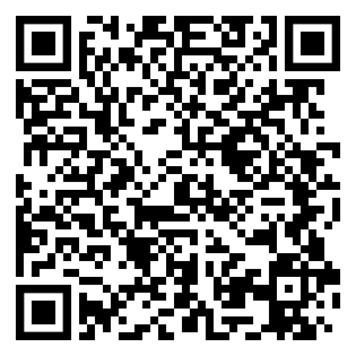

# EYE of LOLA

## Getting started

1. Get a Facebook and Instagram account
2. [Link Instagram with Facebook](https://help.instagram.com/176235449218188)
3. [Install Spark AR Studio](https://sparkar.facebook.com/ar-studio/)
4. [Download workshop assets](https://github.com/nuncsociety/eye/archive/refs/heads/main.zip)

## Create Spark filter

1. Open Spark and login in with Facebook account
2. Open **spark-eye.arproj**
3. Create a texture to be visible in the eye using your preferred software
4. Replace the texture named **eyeLeftTex** and **eyeRightTex** under **Assets**
5. Click **Video** in the sidebar and choose your camera to preview in your eyes
6. Click **Test on device** and under **Preview in App** and **Instagram** click **Send**
7. Open Instagram on your mobile device and preview the effect
8. Iterate.

_Feel free to add other techniques and face filters_

## Create QR Code

1. Save the **Test Link**
2. Visit https://www.qrcode-monkey.com/ and enter the link under **Your URL**. Press Enter on your keyboard.
3. **Customize Design** if you want.
4. Click **Create QR Code** and **Download PNG**
5. Name the image **EYE_XX_YY.png** eg. **EYE_01_JJ.png**.
6. [Upload here](https://bit.ly/3foQRin)

## Congratulations

You've successfully accomplished all the steps.

Rest.
