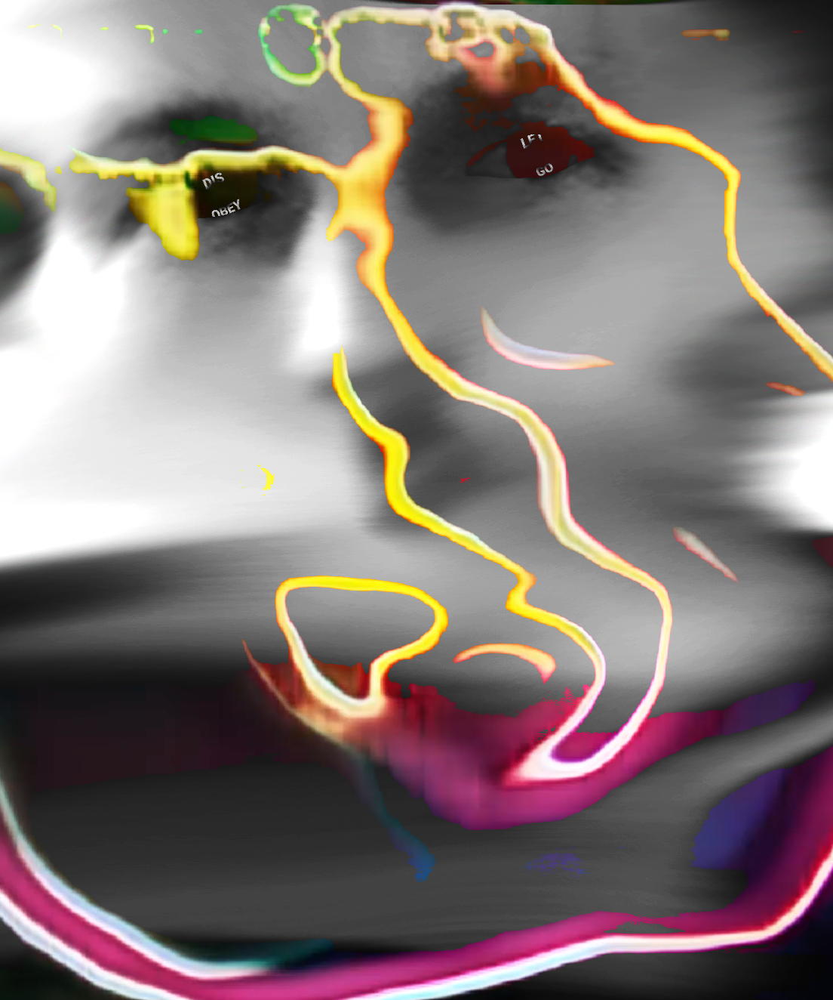

# EYE of LOLA

Together we will create filters revealing meaningful messages and questions from beyond. We will use Augmented Reality and place textures in the eyes. The filters will be accessed through QR codes, scattered around the venue.

## Getting started

1. Get a Facebook and Instagram account
2. Install and update Instagram on your mobile device
3. [Link Instagram with Facebook](https://help.instagram.com/176235449218188)
4. [Install Spark AR Studio](https://sparkar.facebook.com/ar-studio/)
5. [Download workshop assets](https://github.com/nuncsociety/eye/archive/refs/heads/main.zip)

## Create Spark filter

1. Open Spark and login in with Facebook account
2. Open **spark-eye.arproj**
3. Create a texture to be visible in the eye using your preferred software
4. Replace the texture named **eyeLeftTex** and **eyeRightTex** under **Assets** ([eye reference](https://www.figma.com/file/4Fnqy5FVI8rA13gIdBGARk/Basement9)) by right-click and click **Replace**.
5. Click **Video** in the sidebar and choose your camera to preview in your eyes or pause the template video and zoom in.
6. Click **Test on device** and under **Preview in App** and **Instagram** click **Send**
7. Open Instagram on your mobile device and preview the effect
8. Iterate.

Please consider focusing on typography, and powerful words and sentences. It can be bold, large, tiny, succinct. You decide. _If you want to use the full face, that's OK but focus on the eyes at first._

## Create QR Code

1. Save the **Test Link**
2. Visit the [QR code generator](https://www.qrcode-monkey.com/) and enter the link under **Your URL**. Press Enter on your keyboard.
3. **Customize Design** if you want.
4. Click **Create QR Code** and **Download PNG**
5. Name the image **EYE_YY.png** eg. **EYE_JJ.png**.
6. [Upload here](https://bit.ly/3foQRin)

## Congratulations

You've successfully accomplished all the steps.

Rest.
